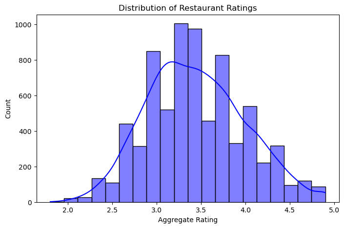

# Restaurant Recommendation using NLP for Zomato Dataset
## Use Case
Building a restaurant recommendation system using NLP and filtering techniques. The project involves exploring the dataset to identify popular cuisines, locations and rating trends. The system recommends similar restaurants based on the user input. The analysis includes handling missing data and using a simple content-based recommender that can serve as a prototype for real-world food recommendation systems.

## Front End

 Top cities by average rating.\
 

CorrelationHeatmap.\

Top 10 cities with most restaurants.\

Pie chart for online vs offline delivery.\

Top 10 popular cuisines.\

Price range distribution.\

Rating of restaurants.\

Top 10 restaurants.\

